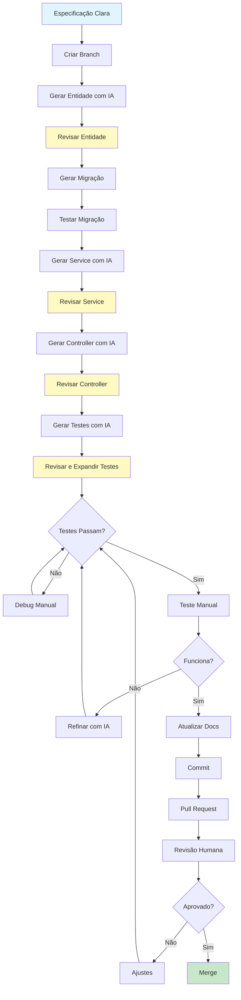

# Desenvolvimento com Agentes de IA

Este documento descreve boas práticas, padrões e guidelines para desenvolvimento com agentes de IA (Cursor, GitHub Copilot, ChatGPT, etc.) no projeto ProductStore, garantindo código seguro, escalável e de alta qualidade.

---

## Índice

1. [Princípios Fundamentais](#princípios-fundamentais)
2. [Segurança em Desenvolvimento com IA](#segurança-em-desenvolvimento-com-ia)
3. [Padrões de Prompts](#padrões-de-prompts)
4. [Revisão de Código Gerado por IA](#revisão-de-código-gerado-por-ia)
5. [Gestão de Contexto](#gestão-de-contexto)
6. [Documentação e Commit Messages](#documentação-e-commit-messages)
7. [Testes e Validação](#testes-e-validação)
8. [Refactoring com IA](#refactoring-com-ia)
9. [Debugging Assistido](#debugging-assistido)
10. [Anti-Patterns e Armadilhas](#anti-patterns-e-armadilhas)
11. [Checklist de Qualidade](#checklist-de-qualidade)

---

## Princípios Fundamentais

### 1. **IA é Assistente, Não Substituto**

```
✅ BOM:
"Adicione validação de email no RegisterRequest usando FluentValidation, 
seguindo o padrão dos validators existentes em Validation/"

❌ RUIM:
"Faça tudo para adicionar validação de email"
```

**Princípio:** Seja específico, forneça contexto, mantenha controlo.

### 2. **Segurança Primeiro**

```
✅ BOM:
"Adicione rate limiting ao endpoint /api/products, 
SEM expor informações sensíveis nos logs"

❌ RUIM:
"Adicione rate limiting" (IA pode logar dados sensíveis)
```

**Princípio:** Sempre especifique requisitos de segurança explicitamente.

### 3. **Validação Humana Obrigatória**

```
✅ BOM:
1. IA gera código
2. VOCÊ revisa linha por linha
3. VOCÊ testa manualmente
4. VOCÊ valida segurança
5. Commit

❌ RUIM:
1. IA gera código
2. Commit direto (NUNCA FAÇA ISSO!)
```

**Princípio:** Todo código gerado por IA deve ser revisado por humano antes de produção.

### 4. **Documentação Explícita**

```
✅ BOM:
"Adicione comentários XML nos métodos públicos, 
explicando PROPÓSITO e não implementação"

❌ RUIM:
"Adicione comentários" (IA tende a gerar comentários óbvios)
```

**Princípio:** Documente intenção, não implementação óbvia.

---

## Segurança em Desenvolvimento com IA

### 🔒 Regra de Ouro: NUNCA compartilhe credenciais com IA

#### ✅ PERMITIDO compartilhar com IA:

- Estrutura de código (Controllers, Services, Models)
- Lógica de negócio
- Testes
- Configurações **sem valores secretos** (ex: `appsettings.json` com placeholders)
- Documentação
- Schemas de banco de dados
- Fluxos de dados

#### ❌ PROIBIDO compartilhar com IA:

- Arquivos `.env` com credenciais reais
- Tokens de API (JWT keys, Cosmos tokens, Turnstile secrets)
- Passwords ou hashes
- Connection strings com credenciais
- Chaves privadas (SSH, SSL, etc)
- Dados pessoais de utilizadores reais
- Backups de banco de dados com dados reais

### Padrão Seguro para Configurações:

**Quando pedir ajuda com configuração:**

```csharp
// ✅ BOM - Compartilhar com IA:
public class JwtOptions
{
    public string Key { get; set; } = string.Empty;  // Placeholder
    public string Issuer { get; set; } = "ProductStore";
}

// ❌ RUIM - NUNCA compartilhar:
var jwtKey = "2DIIBTpSZZEp+JZGK4axRSG..."; // REAL KEY!
```

### Validação de Segurança Pós-IA:

Após IA gerar código, **SEMPRE** verificar:

```bash
# 1. Buscar por possíveis credenciais hardcoded
git grep -i "password\s*=\s*['\"]" 
git grep -i "token\s*=\s*['\"]"
git grep -i "key\s*=\s*['\"]"

# 2. Verificar se .env está no .gitignore
git check-ignore .env

# 3. Verificar histórico Git
git log --all --full-history -- .env
```

### Princípios de Segurança:

1. **Princípio do Menor Privilégio**: IA só deve "ver" código necessário para a tarefa
2. **Defense in Depth**: Múltiplas camadas de validação (IA → Você → Linter → Testes)
3. **Zero Trust**: Sempre assumir que código da IA pode ter falhas de segurança
4. **Auditoria**: Manter histórico de mudanças geradas por IA (via commits descritivos)

---

## Padrões de Prompts

### Template de Prompt Eficaz:

```markdown
**CONTEXTO:**
[Explique o que já existe no projeto]

**OBJETIVO:**
[O que você quer alcançar]

**REQUISITOS:**
- [Requisito funcional 1]
- [Requisito não-funcional 1 - segurança, performance, etc]
- [Padrão a seguir no projeto]

**RESTRIÇÕES:**
- NÃO [o que evitar]
- DEVE seguir [padrão existente]

**EXEMPLO:**
[Referência de código similar no projeto]
```

### Exemplos Práticos:

#### ✅ Prompt BOM - Criar Endpoint:

```
CONTEXTO:
Temos ProductsController com CRUD completo. Todos endpoints usam:
- FluentValidation para validação
- EnableRateLimiting("api-global") 
- Retornam Problem Details em erros
- Services para lógica de negócio

OBJETIVO:
Adicionar endpoint GET /api/products/export para exportar todos produtos em JSON

REQUISITOS:
- Autenticação obrigatória ([Authorize])
- Rate limiting global
- Retornar ProductExportDto[] (criar DTO se necessário)
- Usar ProductService.GetAllForExportAsync()
- Content-Type: application/json
- Logar operação de export

RESTRIÇÕES:
- NÃO incluir dados sensíveis (IDs internos, metadata do DB)
- NÃO paginar (export completo)
- DEVE validar que tenant tem produtos (retornar 400 se vazio)

EXEMPLO:
Ver ProductsController.GetList() para padrão de retorno
```

#### ❌ Prompt RUIM:

```
Crie um endpoint de export de produtos em JSON
```

**Problema:** Vago, sem contexto, sem requisitos de segurança, sem padrões.

---

### Prompts para Tarefas Comuns:

#### 1. Criar Nova Entidade:

```
Crie entidade `Order` com:
- GUID Id (PK)
- GUID UserId (FK para tenant)
- List<OrderItem> Items (1:N)
- Propriedades de auditoria (CreatedAt, UpdatedAt)

Siga padrão de Product.cs:
- Nullable reference types habilitado
- Validação via FluentValidation separada
- Configuração EF Core em AppDbContext.OnModelCreating

NÃO adicione lógica de negócio na entidade (anemic model)
```

#### 2. Adicionar Validação:

```
Adicione validação no CreateOrderRequest:
- Items: mínimo 1, máximo 50
- Cada item: ProductId obrigatório, Quantity > 0, Price >= 0
- Validação customizada: somar total < R$ 50.000

Use FluentValidation, siga padrão de CreateProductRequestValidator.cs
Mensagens de erro em português
```

#### 3. Criar Migração EF:

```
Crie migração para adicionar tabela Orders e OrderItems

ANTES de gerar migração:
1. Adicione configuração em AppDbContext.OnModelCreating
2. Configure relacionamentos (Order → OrderItem cascade delete)
3. Adicione índices (UserId, CreatedAt)

DEPOIS de gerar migração:
1. Revise SQL gerado
2. Teste rollback (Down() method)
3. Valide que não quebra dados existentes
```

#### 4. Adicionar Teste:

```
Adicione teste de integração para POST /api/orders/create:

Cenários:
1. ✅ Criação válida retorna 201 + OrderResponse
2. ❌ Lista vazia retorna 400 + ValidationProblemDetails
3. ❌ ProductId inexistente retorna 404
4. ❌ Quantity zero retorna 400

Use WebApplicationFactory como em ProductCrudPipelineTests.cs
SQLite in-memory para isolamento
NÃO use dados hardcoded (use builders/factories)
```

---

## Revisão de Código Gerado por IA

### Checklist de Revisão:

#### 1. **Segurança** 🔒

```csharp
// ❌ IA pode gerar (PERIGOSO):
var query = $"SELECT * FROM Products WHERE Name = '{name}'"; // SQL Injection!

// ✅ VOCÊ deve corrigir:
var products = await db.Products
    .Where(p => p.Name == name)
    .ToListAsync(); // EF Core parameterizado
```

**Verificar:**
- [ ] Sem SQL injection (use EF Core ou parametrizado)
- [ ] Sem credenciais hardcoded
- [ ] Validação de entrada (FluentValidation)
- [ ] Autorização correta (tenant isolation)
- [ ] Rate limiting aplicado
- [ ] Logs não expõem dados sensíveis

#### 2. **Performance** ⚡

```csharp
// ❌ IA pode gerar (LENTO):
var products = await db.Products.ToListAsync(); // Carrega TUDO
var filtered = products.Where(p => p.Price > 100).ToList(); // Filtra em memória

// ✅ VOCÊ deve corrigir:
var filtered = await db.Products
    .Where(p => p.Price > 100) // Filtra no DB
    .ToListAsync();
```

**Verificar:**
- [ ] Queries filtradas no DB (não em memória)
- [ ] Paginação em listagens
- [ ] Lazy loading apropriado
- [ ] Índices existem para queries frequentes
- [ ] Sem N+1 queries (use `.Include()` ou projeção)

#### 3. **Padrões do Projeto** 📐

```csharp
// ❌ IA pode gerar (inconsistente):
public async Task<Product> GetProduct(Guid id) // Retorna entidade
{
    return await db.Products.FindAsync(id);
}

// ✅ VOCÊ deve corrigir (segue padrão):
public async Task<ProductResponse> GetByIdAsync(Guid id, CancellationToken ct)
{
    var product = await db.Products.FindAsync(new object[] { id }, ct)
        ?? throw new ProductNotFoundException(id);
    return MapToResponse(product); // Retorna DTO
}
```

**Verificar:**
- [ ] Nomenclatura consistente (Async suffix, verbos corretos)
- [ ] DTOs para entrada/saída (não entidades)
- [ ] Exceções customizadas (não genéricas)
- [ ] CancellationToken em métodos assíncronos
- [ ] Logging estruturado
- [ ] Comentários úteis (não óbvios)

#### 4. **Testes** 🧪

```csharp
// ❌ IA pode gerar (frágil):
var product = new Product { Name = "Test", Price = 100 }; // Hardcoded

// ✅ VOCÊ deve corrigir:
var product = new ProductBuilder()
    .WithName("Test Product")
    .WithPrice(100m)
    .Build(); // Builder pattern
```

**Verificar:**
- [ ] Testes isolados (sem dependências entre testes)
- [ ] Dados gerados (não hardcoded)
- [ ] Cenários positivos E negativos
- [ ] Assertions claras
- [ ] Cleanup de recursos

---

## Gestão de Contexto

### Fornecendo Contexto Eficaz à IA:

#### 1. **Contexto de Arquitetura:**

```markdown
# Forneça sempre que começar nova feature:

Este projeto usa:
- ASP.NET Core 10 com Controllers (não Minimal APIs)
- EF Core com SQLite multi-tenant (database-per-tenant)
- FluentValidation para validação
- Problem Details (RFC 7807) para erros
- JWT Bearer para autenticação
- Repository pattern NÃO é usado (Services acessam DbContext diretamente)
```

#### 2. **Contexto de Convenções:**

```markdown
Convenções do projeto:

Nomenclatura:
- Controllers: [Entity]Controller (ex: ProductsController)
- Services: I[Entity]Service / [Entity]Service
- DTOs: [Entity][Action]Request/Response (ex: CreateProductRequest)
- Validators: [Dto]Validator (ex: CreateProductRequestValidator)
- Exceptions: [Entity][Reason]Exception (ex: ProductNotFoundException)

Organização:
- Controllers/ - endpoints HTTP
- Services/ - lógica de negócio
- DTOs/ - contratos de API
- Models/ - entidades EF
- Validation/ - FluentValidation validators
- Exceptions/ - exceções customizadas
- Domain/ - regras de negócio
```

#### 3. **Contexto de Dependências:**

```markdown
Packages instalados:
- FluentValidation.AspNetCore 11.3.1
- Microsoft.AspNetCore.Authentication.JwtBearer 10.0.5
- Microsoft.EntityFrameworkCore.Sqlite 10.0.5

NÃO sugira instalar:
- AutoMapper (fazemos mapping manual)
- MediatR (CQRS não é usado)
- Swashbuckle (usamos ASP.NET Core OpenAPI nativo)
```

### Reduzindo Contexto Desnecessário:

```markdown
❌ Evite compartilhar:
- Binários (bin/, obj/)
- node_modules/
- Arquivos gerados (.dll, .pdb, dist/)
- Histórico completo do Git
- Documentação externa (links são suficientes)

✅ Compartilhe:
- Código fonte relevante
- Testes relacionados
- Documentação do projeto (README, ARCHITECTURE)
- Exemplos de código similar
```

---

## Documentação e Commit Messages

### Documentação Gerada por IA:

#### ✅ BOM - Comentários Úteis:

```csharp
/// <summary>
/// Valida e aplica a regra de preço mínimo para produtos eletrónicos.
/// Categoria "eletrônico" (case-insensitive) exige preço >= R$ 50.00.
/// </summary>
/// <exception cref="ElectronicsMinPriceException">
/// Quando categoria é eletrônico e preço é menor que o mínimo.
/// </exception>
public static void EnsureElectronicsMinPrice(string categoryName, decimal price)
```

#### ❌ RUIM - Comentários Óbvios:

```csharp
/// <summary>
/// Obtém produto por ID
/// </summary>
/// <param name="id">ID do produto</param>
/// <returns>Produto</returns>
public async Task<Product> GetById(Guid id) // ÓBVIO!
```

### Commit Messages com IA:

#### Template para Commits Gerados por IA:

```
[Tipo]: Descrição curta (50 caracteres)

Detalhes:
- O que foi alterado
- Por que foi alterado
- Impacto (breaking changes, migrações, etc)

Gerado com: [Cursor/Copilot/ChatGPT]
Revisado por: [Seu Nome]
```

#### Exemplos:

```
✅ BOM:
feat: Adiciona endpoint de export de produtos

Detalhes:
- Novo endpoint GET /api/products/export
- Retorna todos produtos do tenant em JSON
- Valida que tenant tem produtos antes de exportar
- Adiciona ProductExportDto com campos públicos

Gerado com: Cursor
Revisado por: João Silva

---

❌ RUIM:
Update ProductsController.cs
```

### Versionamento com IA:

```markdown
Quando IA faz mudanças significativas:

1. Crie branch específica:
   git checkout -b feature/ai-generated-export-endpoint

2. Commits incrementais (não um commit gigante):
   - Commit 1: Adiciona DTO
   - Commit 2: Adiciona service method
   - Commit 3: Adiciona controller endpoint
   - Commit 4: Adiciona testes

3. Pull Request com revisão humana:
   - Descreva o que IA fez
   - Destaque pontos que você validou
   - Liste testes executados
```

---

## Testes e Validação

### Testes Gerados por IA:

#### Padrão de Teste com IA:

```csharp
// 1. ARRANGE - IA ajuda a preparar dados
var factory = new WebApplicationFactory<Program>();
var client = factory.CreateClient();
var request = new CreateProductRequest
{
    Sku = "TEST-001",
    Name = "Produto Teste",
    Price = 100m,
    CategoryId = category.Id
};

// 2. ACT - IA gera chamada HTTP
var response = await client.PostAsJsonAsync("/api/products", request);

// 3. ASSERT - VOCÊ valida cenários
Assert.Equal(HttpStatusCode.Created, response.StatusCode);
var product = await response.Content.ReadFromJsonAsync<ProductResponse>();
Assert.NotNull(product);
Assert.Equal(request.Name, product.Name);
// ADICIONE MAIS ASSERTIONS (IA tende a gerar poucas)
```

#### Cenários de Teste Obrigatórios:

```markdown
Para CADA endpoint gerado por IA, EXIJA:

1. ✅ Happy Path (cenário válido)
2. ❌ Validação (campos obrigatórios faltando)
3. ❌ Autorização (sem JWT / JWT inválido)
4. ❌ Não encontrado (ID inexistente)
5. ❌ Conflito (duplicação de dados únicos)
6. ⚡ Rate limiting (muitas requisições)
```

### Validação Manual Pós-IA:

```bash
# 1. Compilação
dotnet build --configuration Release

# 2. Testes
dotnet test

# 3. Linter
dotnet format --verify-no-changes

# 4. Análise de segurança
dotnet list package --vulnerable

# 5. Build frontend
npm run build

# 6. Testes frontend (se houver)
npm test
```

---

## Refactoring com IA

### Padrão Seguro de Refactoring:

```markdown
1. **ANTES de pedir refactoring à IA:**
   - Crie branch nova
   - Rode testes e garanta que passam
   - Commit estado atual
   - Tag ou note o commit hash

2. **Solicite refactoring:**
   "Refatore ProductService.CreateAsync() para:
   - Extrair validação de SKU para método privado
   - Extrair lógica de Cosmos para método privado
   - Manter exatamente a mesma lógica (sem mudanças funcionais)
   
   Requisitos:
   - NÃO mudar assinatura pública do método
   - NÃO mudar comportamento
   - Manter tratamento de exceções
   - Adicionar comentários nos métodos extraídos"

3. **APÓS IA refatorar:**
   - Compare diff cuidadosamente
   - Rode TODOS os testes
   - Teste manualmente cenários críticos
   - Se algo quebrou, reverta e tente incremental

4. **Commit:**
   git commit -m "refactor: Extrai métodos privados em ProductService
   
   - ExtractSkuValidation()
   - ExtractCosmosData()
   
   Nenhuma mudança funcional.
   Testes: ✅ Todos passando"
```

### Anti-Pattern: Refactoring Agressivo

```markdown
❌ NUNCA faça:
"Refatore toda aplicação para usar CQRS + MediatR + AutoMapper"

Problemas:
- Mudanças massivas = alto risco
- Difícil de revisar
- Difícil de reverter
- Pode introduzir bugs sutis

✅ Em vez disso:
"Refatore APENAS ProductsController para extrair validação 
complexa em validator separado, mantendo resto igual"
```

---

## Debugging Assistido

### Usando IA para Debug:

#### Template de Prompt para Debug:

```markdown
PROBLEMA:
[Descreva o erro observado]

COMPORTAMENTO ESPERADO:
[O que deveria acontecer]

COMPORTAMENTO ATUAL:
[O que está acontecendo]

CÓDIGO RELEVANTE:
[Cole método/classe com problema]

STACK TRACE / LOGS:
[Cole erro completo - REMOVA dados sensíveis antes!]

TESTES:
[Cole teste que falha, se houver]

JÁ TENTEI:
[O que você já tentou]
```

#### Exemplo Prático:

```markdown
PROBLEMA:
Endpoint POST /api/products retorna 500 ao criar produto com SKU Cosmos

COMPORTAMENTO ESPERADO:
Produto criado com dados da API Bluesoft, retorna 201 Created

COMPORTAMENTO ATUAL:
Exceção: System.NullReferenceException em ProductService.cs linha 67

CÓDIGO RELEVANTE:
```csharp
// ProductService.cs:67
var name = cosmosDto.Description ?? request.Name; // NullReferenceException aqui
```

STACK TRACE:
```
System.NullReferenceException: Object reference not set to an instance
   at ProductStore.Api.Services.ProductService.CreateAsync()
```

JÁ TENTEI:
- Verificar se cosmosDto é null (não é)
- Adicionar breakpoint (cosmosDto.Description é null, request também é null)
```

### IA NÃO Substitui Debugging Tradicional:

```markdown
✅ Use IA para:
- Sugerir possíveis causas
- Gerar código de teste
- Explicar erros obscuros
- Sugerir ferramentas de debug

❌ NÃO confie cegamente:
- IA não vê estado runtime
- IA não tem acesso ao debugger
- IA pode "alucinar" causas
- SEMPRE valide sugestões com debugger real
```

---

## Anti-Patterns e Armadilhas

### 1. **Over-Engineering Sugerido pela IA**

```csharp
// ❌ IA pode sugerir (complexidade desnecessária):
public interface IProductRepository { }
public interface IProductFactory { }
public interface IProductMapper { }
public interface IProductValidator { }
// ... para um CRUD simples

// ✅ VOCÊ deve simplificar:
public interface IProductService { } // Suficiente!
```

**Regra:** YAGNI (You Aren't Gonna Need It) - não adicione complexidade antes de precisar.

### 2. **Magic Strings e Números**

```csharp
// ❌ IA pode gerar:
if (category.Name.ToLower() == "eletrônico") // Magic string
{
    if (price < 50) // Magic number
        throw new Exception("Preço inválido"); // Exceção genérica
}

// ✅ VOCÊ deve refatorar:
if (CategoryRules.IsElectronics(category.Name))
{
    if (price < CategoryRules.ElectronicsMinPrice)
        throw new ElectronicsMinPriceException(CategoryRules.ElectronicsMinPrice);
}
```

### 3. **Async/Await Incorreto**

```csharp
// ❌ IA pode gerar:
public async Task<Product> GetProduct(Guid id)
{
    return await Task.Run(() => db.Products.Find(id)); // NÃO USE Task.Run!
}

// ✅ VOCÊ deve corrigir:
public async Task<Product> GetProductAsync(Guid id)
{
    return await db.Products.FindAsync(id); // Async real do EF Core
}
```

### 4. **Exception Handling Excessivo**

```csharp
// ❌ IA tende a gerar:
try
{
    var product = await GetProduct(id);
}
catch (Exception ex) // Muito genérico!
{
    logger.LogError(ex.Message);
    throw; // Apenas re-throw genérico
}

// ✅ VOCÊ deve refatorar:
// Deixe GlobalExceptionHandler tratar, ou capture exceção específica
var product = await GetProduct(id); // Exceções específicas vão para handler
```

### 5. **DTOs Espelhando Entidades Completamente**

```csharp
// ❌ IA pode gerar (exposição excessiva):
public class ProductResponse
{
    public Guid Id { get; set; }
    public string Sku { get; set; }
    // ... todos os campos incluindo internos
    public DateTime CreatedAt { get; set; }
    public DateTime UpdatedAt { get; set; }
    public byte[] RowVersion { get; set; } // Dados internos!
}

// ✅ VOCÊ deve limitar:
public class ProductResponse
{
    public Guid Id { get; set; }
    public string Sku { get; set; }
    // ... apenas campos relevantes para cliente
}
```

### 6. **Logging Excessivo ou Insuficiente**

```csharp
// ❌ IA pode gerar (verboso):
logger.LogInformation("Iniciando GetProduct");
logger.LogInformation($"ID recebido: {id}");
logger.LogInformation("Consultando banco de dados");
var product = await db.Products.FindAsync(id);
logger.LogInformation("Produto encontrado");
logger.LogInformation($"Produto: {product.Name}"); // PII!
return product;

// ✅ VOCÊ deve simplificar:
logger.LogDebug("Buscando produto {ProductId}", id);
var product = await db.Products.FindAsync(id);
if (product == null)
    logger.LogWarning("Produto {ProductId} não encontrado", id);
return product;
```

---

## Checklist de Qualidade

### Antes de Aceitar Código da IA:

#### ✅ Segurança
- [ ] Sem credenciais hardcoded
- [ ] Validação de entrada presente
- [ ] Autorização/autenticação correta
- [ ] Sem SQL injection (EF parametrizado)
- [ ] Logs não expõem dados sensíveis
- [ ] Rate limiting aplicado (se necessário)
- [ ] CORS configurado corretamente

#### ✅ Performance
- [ ] Queries otimizadas (filtros no DB)
- [ ] Paginação em listagens
- [ ] Sem N+1 queries
- [ ] Async/await usado corretamente
- [ ] Sem Task.Run desnecessário

#### ✅ Padrões do Projeto
- [ ] Nomenclatura consistente
- [ ] DTOs para entrada/saída
- [ ] Exceções customizadas
- [ ] FluentValidation para validação
- [ ] Problem Details para erros
- [ ] CancellationToken em métodos async

#### ✅ Manutenibilidade
- [ ] Código legível (sem "clever code")
- [ ] Comentários úteis (não óbvios)
- [ ] Métodos pequenos (< 50 linhas idealmente)
- [ ] Responsabilidade única
- [ ] Sem duplicação de código

#### ✅ Testes
- [ ] Testes existentes continuam passando
- [ ] Novos testes para novo código
- [ ] Cenários positivos E negativos
- [ ] Testes isolados (sem side effects)

#### ✅ Documentação
- [ ] README atualizado (se necessário)
- [ ] Comentários XML em APIs públicas
- [ ] CHANGELOG atualizado (se necessário)
- [ ] Commit message descritivo

### Antes de Fazer Deploy:

```bash
# Checklist de Deployment
dotnet build --configuration Release  # ✅ Compila sem warnings
dotnet test                            # ✅ Todos testes passando
npm run build                          # ✅ Build frontend OK
git diff                               # ✅ Revisei todas mudanças
# ✅ Testei manualmente features afetadas
# ✅ Verifiquei logs não expõem dados sensíveis
# ✅ Confirmei que .env não foi commitado
# ✅ Executei migrations (se houver)
```

---

## Workflows com IA

### Workflow 1: Nova Feature Completa



### Workflow 2: Debugging com IA

```markdown
1. Reproduzir bug localmente
2. Adicionar logs/breakpoints
3. Identificar método/classe problemática
4. Preparar contexto para IA:
   - Código problemático
   - Stack trace (SEM dados sensíveis)
   - Comportamento esperado vs atual
5. Pedir sugestões à IA
6. Validar sugestões com debugger
7. Implementar fix
8. Adicionar teste de regressão
9. Commit com referência ao bug
```

### Workflow 3: Refactoring Incremental

```markdown
1. Identificar code smell
2. Garantir cobertura de testes existente
3. Criar branch de refactoring
4. Pedir à IA refactor de 1 método por vez
5. Rodar testes após cada mudança
6. Se falhar, reverter e ajustar
7. Quando tudo passar, commit incremental
8. Repetir para próximo método
9. Pull request com comparação before/after
```

---

## Boas Práticas Específicas por Linguagem

### C# / .NET

```csharp
// ✅ Peça à IA:
// - Usar nullable reference types
// - Async/await para I/O
// - LINQ para queries
// - Pattern matching moderno
// - Record types para DTOs imutáveis

// ❌ Evite aceitar da IA:
// - ConfigureAwait(false) desnecessário (ASP.NET Core não precisa)
// - Task.Run para I/O (use async real)
// - Reflection excessiva
// - Unsafe code sem justificativa
```

### TypeScript / React

```typescript
// ✅ Peça à IA:
// - Hooks modernos (useState, useEffect, useContext)
// - TypeScript strict mode
// - Componentes funcionais (não classes)
// - Props tipadas com interfaces

// ❌ Evite aceitar da IA:
// - any types (use unknown ou tipos específicos)
// - Componentes de classe (use functional)
// - useEffect sem array de dependências
// - Mutação direta de state
```

---

## Ferramentas Complementares

### Linters e Formatters:

```bash
# Backend (.NET)
dotnet format                    # Formatter
dotnet build /p:TreatWarningsAsErrors=true

# Frontend (TypeScript/React)
npm run lint                     # ESLint
npm run format                   # Prettier (se configurado)
```

### Análise de Segurança:

```bash
# Dependências vulneráveis
dotnet list package --vulnerable
npm audit

# Secrets scanning
git secrets --scan              # Instalar: https://github.com/awslabs/git-secrets
trufflehog git file://. --only-verified
```

### Code Review Automatizado:

- **SonarQube** / SonarCloud - Análise de qualidade
- **CodeClimate** - Manutenibilidade
- **Snyk** - Vulnerabilidades

---

## Recursos e Referências

### Documentação do Projeto:
- `README.md` - Setup e features
- `ARCHITECTURE.md` - Arquitetura técnica
- `SECURITY.md` - Guia de segurança

### Best Practices Externas:
- [Microsoft .NET Guidelines](https://learn.microsoft.com/dotnet/standard/design-guidelines/)
- [React Best Practices](https://react.dev/learn/thinking-in-react)
- [OWASP Top 10](https://owasp.org/www-project-top-ten/)
- [Conventional Commits](https://www.conventionalcommits.org/)

### Prompting Guides:
- [OpenAI Best Practices](https://platform.openai.com/docs/guides/prompt-engineering)
- [Anthropic Prompt Engineering](https://docs.anthropic.com/claude/docs/prompt-engineering)

---

## Conclusão

**Regra de Ouro do Desenvolvimento com IA:**

> "IA é um assistente poderoso, mas VOCÊ é o arquiteto responsável.  
> Todo código gerado deve passar pelo seu crivo de segurança, qualidade e alinhamento com os princípios do projeto."

### Lembre-se:

1. ✅ **Valide sempre** - Não confie cegamente
2. 🔒 **Segurança primeiro** - Nunca comprometa por velocidade
3. 📐 **Consistência importa** - Siga padrões do projeto
4. 🧪 **Teste tudo** - Testes são sua rede de segurança
5. 📚 **Documente decisões** - Seu eu futuro agradecerá

---

**Versão:** 1.0  
**Última atualização:** 2026-04-09  
**Mantido por:** Equipe ProductStore
