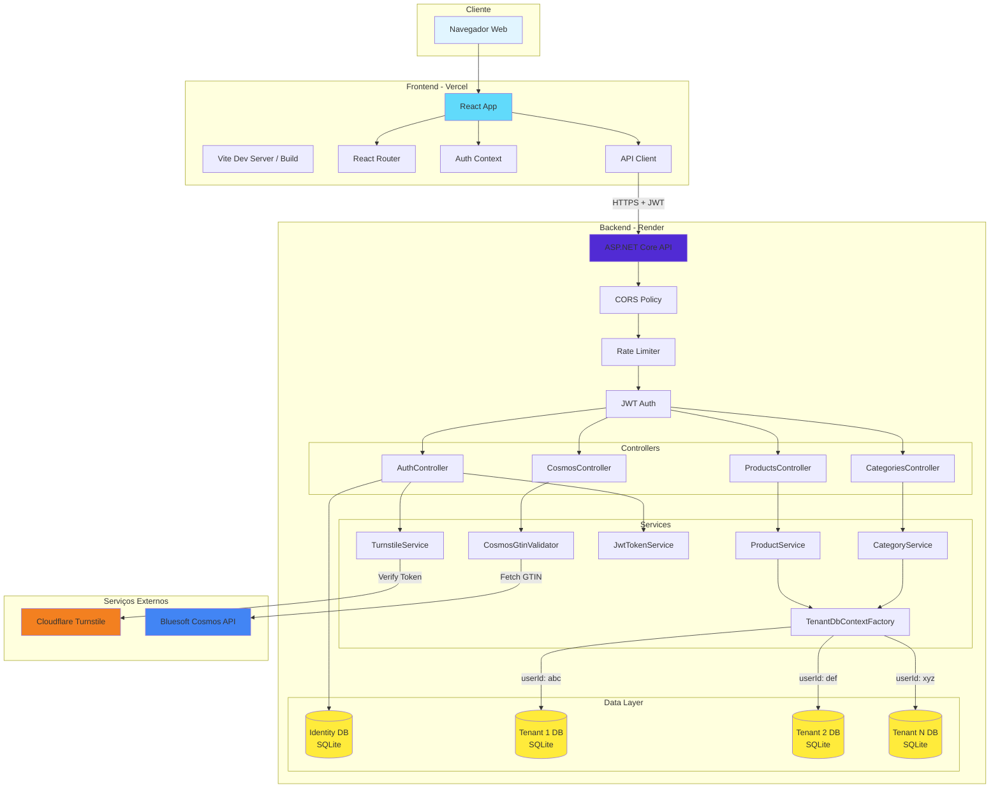
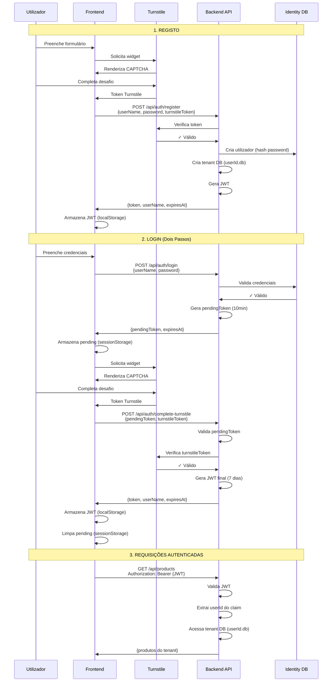
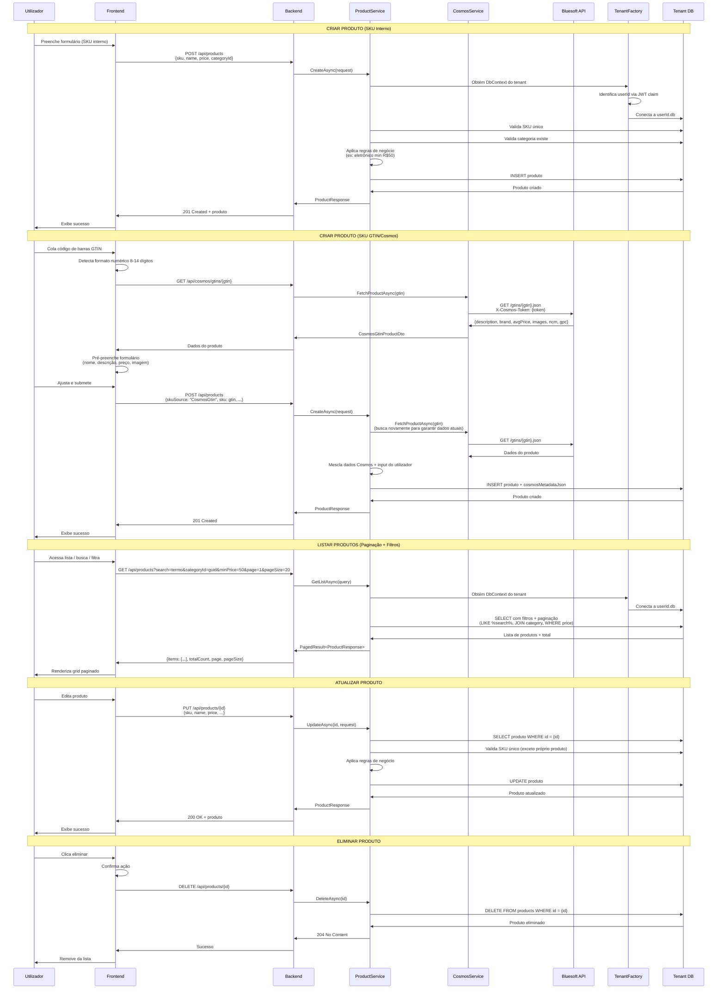
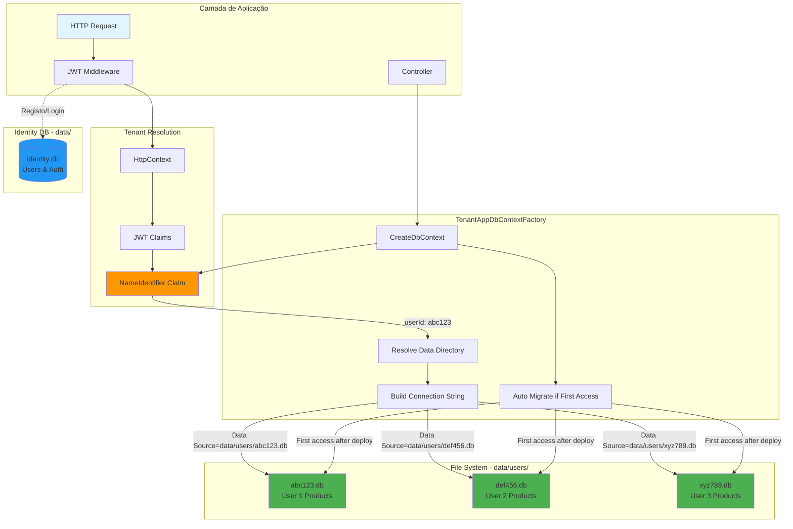
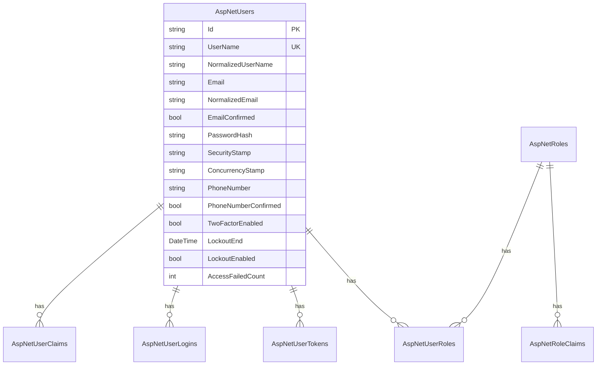
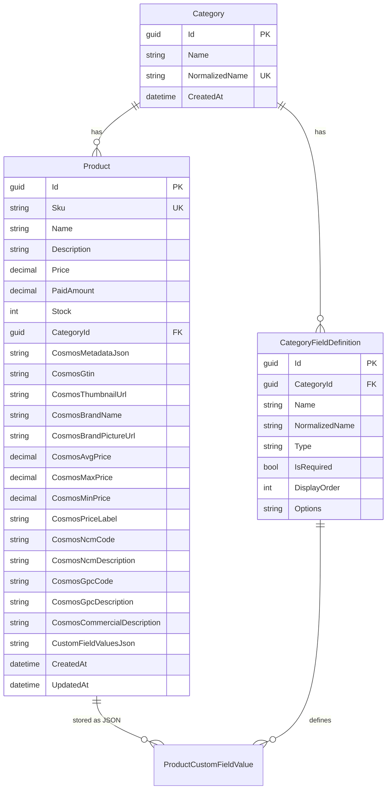
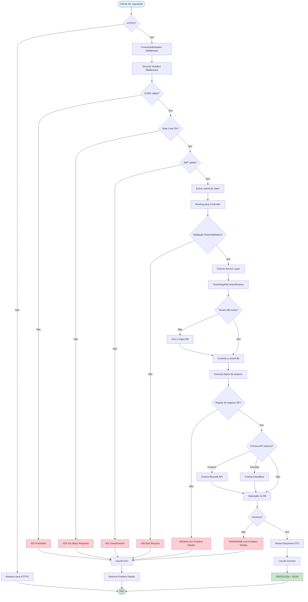
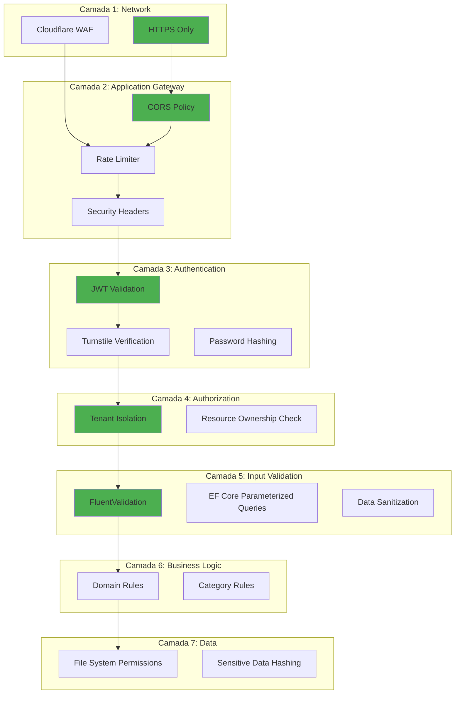

# Arquitetura do ProductStore

Este documento descreve a arquitetura técnica do ProductStore, incluindo estrutura de componentes, fluxo de dados, decisões arquiteturais e diagramas.

## Visão Geral

ProductStore é uma aplicação fullstack multi-tenant para gestão de produtos com integração à API Bluesoft Cosmos (GTIN/EAN).



---

## Stack Tecnológica

### Frontend
| Camada | Tecnologia | Versão |
|--------|-----------|--------|
| Framework | React | 19 |
| Linguagem | TypeScript | 6.0 |
| Build Tool | Vite | 8.0 |
| Routing | React Router | 7 |
| HTTP Client | Fetch API | Nativo |
| Estilo | CSS Modules | Nativo |
| CAPTCHA | Cloudflare Turnstile | - |
| Hospedagem | Vercel | - |

### Backend
| Camada | Tecnologia | Versão |
|--------|-----------|--------|
| Framework | ASP.NET Core | 10 |
| Linguagem | C# | 13 |
| ORM | Entity Framework Core | 10 |
| Database | SQLite | 3 |
| Autenticação | ASP.NET Identity + JWT | 10 |
| Validação | FluentValidation | 11.3 |
| Containerização | Docker | - |
| Hospedagem | Render | - |

---

## Fluxo de Autenticação



---

## Fluxo de Gestão de Produtos



---

## Arquitetura Multi-Tenant

O ProductStore utiliza uma estratégia de **Database-per-Tenant** para isolamento completo de dados.



### Características:

1. **Isolamento Total**: Cada utilizador tem SQLite próprio
2. **Segurança**: Impossível acesso cross-tenant (validado via claim JWT)
3. **Auto-Migração**: Migrações EF aplicadas automaticamente no primeiro acesso
4. **Cache**: `ConcurrentDictionary` rastreia tenants já migrados
5. **Escalabilidade**: Fácil migração futura para PostgreSQL multi-tenant

---

## Modelo de Dados

### Identity Database (`identity.db`)



### Tenant Database (`{userId}.db`)



### Relacionamentos:

- **Category → Product**: 1:N (Restrict on delete - categoria não pode ser eliminada se tiver produtos)
- **Category → CategoryFieldDefinition**: 1:N (Cascade - campos eliminados com categoria)
- **Product.CustomFieldValuesJson**: Armazena valores dos campos personalizados em JSON

---

## Camadas da Aplicação

### 1. Presentation Layer (Controllers)

```
Controllers/
├── AuthController.cs         # Registo, login, Turnstile
├── ProductsController.cs     # CRUD produtos + export/import
├── CategoriesController.cs   # CRUD categorias + campos personalizados
└── CosmosController.cs       # Preview GTIN
```

**Responsabilidades:**
- Validação de entrada (FluentValidation)
- Autenticação/Autorização (JWT)
- Rate Limiting
- Mapeamento DTOs
- Retorno de Problem Details (RFC 7807)

### 2. Business Layer (Services)

```
Services/
├── IProductService.cs / ProductService.cs
├── ICategoryService.cs / CategoryService.cs
├── ICosmosGtinValidator.cs / CosmosGtinValidator.cs
├── ITurnstileVerificationService.cs / TurnstileVerificationService.cs
├── JwtTokenService.cs
├── TenantAppDbContextFactory.cs
├── TenantDatabaseProvisioner.cs
└── CategoryNormalizedNameSync.cs
```

**Responsabilidades:**
- Lógica de negócio
- Regras de domínio (ex: `CategoryRules.ElectronicsMinPrice`)
- Integração com APIs externas (Cosmos, Turnstile)
- Orquestração de operações complexas

### 3. Domain Layer

```
Domain/
├── CategoryRules.cs          # Regras de negócio de categorias
└── SkuSource.cs             # Enum: Internal vs CosmosGtin
```

**Responsabilidades:**
- Regras de negócio centralizadas
- Validações de domínio
- Enums e constantes

### 4. Data Layer

```
Data/
├── AppDbContext.cs                    # Contexto EF do tenant
├── AppIdentityDbContext.cs           # Contexto EF do identity
├── Migrations/                       # Migrações do tenant
└── MigrationsIdentity/              # Migrações do identity
```

**Responsabilidades:**
- Acesso a dados via EF Core
- Configuração de entidades
- Migrações de schema

### 5. Cross-Cutting Concerns

```
Middleware/
└── GlobalExceptionHandler.cs        # Tratamento global de erros

Validation/
├── RegisterRequestValidator.cs
├── LoginRequestValidator.cs
├── CreateProductRequestValidator.cs
└── ...

Exceptions/
└── AppExceptions.cs                 # Exceções de domínio customizadas

Configuration/
├── JwtOptions.cs
├── TurnstileOptions.cs
└── CosmosOptions.cs
```

---

## Fluxo de Dados - Requisição Típica



---

## Decisões Arquiteturais

### 1. **Multi-Tenant com Database-per-Tenant**

**Decisão:** Cada utilizador tem SQLite próprio (`data/users/{userId}.db`)

**Razões:**
- ✅ Isolamento total de dados (segurança máxima)
- ✅ Fácil backup/restore por utilizador
- ✅ Conformidade GDPR (delete total de dados do utilizador)
- ✅ Performance previsível (sem queries cross-tenant)
- ❌ Migrações mais complexas (múltiplos DBs)
- ❌ Não ideal para centenas de milhares de users

**Alternativas consideradas:**
- **Schema-per-Tenant**: Complexidade desnecessária para SQLite
- **Row-Level Security**: Risco de vazamento de dados

### 2. **JWT em localStorage (não em cookies)**

**Decisão:** JWT armazenado em `localStorage`

**Razões:**
- ✅ Simplicidade de implementação
- ✅ Funciona bem com CORS e múltiplas origens
- ✅ Sem problemas com SameSite policies
- ❌ Vulnerável a XSS (mitigado com headers de segurança)
- ❌ Não pode ser invalidado no servidor

**Mitigações:**
- Headers de segurança (X-XSS-Protection, CSP)
- Validação rigorosa de entrada
- Short-lived tokens (7 dias)

**Roadmap futuro:**
- Migrar para cookies HttpOnly + Secure
- Implementar refresh token pattern

### 3. **SQLite em Produção**

**Decisão:** SQLite para MVP/pequena escala

**Razões:**
- ✅ Zero configuração
- ✅ Custo zero (sem serviço de DB separado)
- ✅ Adequado para centenas de utilizadores
- ✅ File-based = fácil backup
- ❌ Limitações de concorrência
- ❌ Não ideal para alta escala

**Quando migrar para PostgreSQL:**
- Mais de 1000 utilizadores ativos
- Necessidade de replicação
- Queries complexas com JOINs pesados
- Necessidade de full-text search avançado

### 4. **React SPA com Client-Side Routing**

**Decisão:** React SPA hospedado na Vercel

**Razões:**
- ✅ Deploy automático via Git
- ✅ CDN global
- ✅ HTTPS gratuito
- ✅ Separação clara front/back
- ❌ SEO limitado (não é crítico para app interna)

### 5. **Rate Limiting por IP**

**Decisão:** Rate limiting global em todos endpoints autenticados

**Razões:**
- ✅ Proteção contra abuse/DDoS
- ✅ Controlo de custos (API Cosmos)
- ✅ `ForwardedHeaders` garante IP real via Render
- ❌ Usuários atrás de NAT compartilham limite
- ❌ VPNs podem ser bloqueados injustamente

**Configuração:**
- Auth endpoints: 5-10 req/min
- APIs gerais: 100 req/min
- Headers `Retry-After` em respostas 429

### 6. **Cloudflare Turnstile (não reCAPTCHA)**

**Decisão:** Turnstile para CAPTCHA

**Razões:**
- ✅ Melhor UX (challenge invisível na maioria dos casos)
- ✅ Privacy-friendly (não rastreia users)
- ✅ Gratuito até 1M req/mês
- ✅ API simples
- ❌ Vendor lock-in (menos crítico que Google)

---

## Performance e Escalabilidade

### Estratégias Atuais:

1. **Paginação**: Todas listagens com `page` + `pageSize` (max 100)
2. **Índices DB**: 
   - `Sku` (unique)
   - `CategoryId` (foreign key)
   - `Category.NormalizedName` (unique)
3. **Lazy Loading**: EF Core não carrega relações desnecessárias
4. **HTTP Caching**: Frontend cacheia categorias (mudam raramente)
5. **Connection Pooling**: EF Core reutiliza conexões SQLite

### Roadmap de Escalabilidade:

| Utilizadores | Estratégia |
|--------------|-----------|
| 0-1K | Atual (SQLite multi-tenant) |
| 1K-10K | Migrar para PostgreSQL multi-tenant (schema-per-tenant) |
| 10K-100K | PostgreSQL + Read replicas + Redis cache |
| 100K+ | Microserviços + Event sourcing + CQRS |

---

## Segurança - Camadas de Defesa



Ver `SECURITY.md` para detalhes completos.

---

## Deployment Architecture

```mermaid
graph TB
    subgraph "Developer"
        Git[Git Push]
    end
    
    subgraph "GitHub"
        Repo[Repository]
        Actions[GitHub Actions<br/>opcional]
    end
    
    subgraph "Vercel - Frontend"
        Vercel_Build[Build: npm run build]
        Vercel_Deploy[Deploy to CDN]
        Vercel_Edge[Edge Network]
    end
    
    subgraph "Render - Backend"
        Render_Docker[Docker Build<br/>Dockerfile]
        Render_Deploy[Deploy Container]
        Render_Service[Web Service<br/>Port :8080]
    end
    
    subgraph "Cloudflare"
        Turnstile_Service[Turnstile API]
    end
    
    subgraph "Bluesoft"
        Cosmos_API[Cosmos API]
    end
    
    subgraph "Client Browser"
        User[Utilizador Final]
    end
    
    Git --> Repo
    Repo -.->|Webhook| Vercel_Build
    Repo -.->|Webhook| Render_Docker
    
    Vercel_Build --> Vercel_Deploy
    Vercel_Deploy --> Vercel_Edge
    
    Render_Docker --> Render_Deploy
    Render_Deploy --> Render_Service
    
    User --> Vercel_Edge
    Vercel_Edge -->|API Calls| Render_Service
    
    Render_Service -->|Verify CAPTCHA| Turnstile_Service
    Render_Service -->|Fetch GTIN| Cosmos_API
    
    style Git fill:#f05032
    style Repo fill:#181717
    style Vercel_Build fill:#000000
    style Render_Docker fill:#46e3b7
    style User fill:#2196f3
```



### Variáveis de Ambiente por Ambiente:

#### Desenvolvimento Local:
```bash
# .env (raiz)
Cosmos__Token=<dev_token>
Jwt__Key=DEV_ONLY...
Turnstile__SecretKey=<dev_secret>

# frontend/.env
VITE_API_BASE_URL=          # vazio = proxy Vite
VITE_TURNSTILE_SITE_KEY=<dev_site_key>
```

#### Produção Vercel (Frontend):
```bash
VITE_API_BASE_URL=https://product-store-api.onrender.com
VITE_TURNSTILE_SITE_KEY=<prod_site_key>
```

#### Produção Render (Backend):
```bash
ASPNETCORE_ENVIRONMENT=Production
Jwt__Key=<48_bytes_base64_random>
CORS_ORIGINS=https://product-store.vercel.app
Turnstile__SecretKey=<prod_secret>
Cosmos__Token=<prod_token>
AllowedHosts=product-store-api.onrender.com
```

---

## Monitorização e Observabilidade

### Logs Estruturados:

```csharp
logger.LogInformation("Criando produto SKU={Sku}", request.Sku);
logger.LogWarning("Conflito de SKU: {Sku}", dup.Sku);
logger.LogError(exception, "Falha ao migrar tenant {UserId}", userId);
```

### Métricas Recomendadas:

- **Taxa de erro** por endpoint (alertar se > 5%)
- **Latência p95** das APIs (alertar se > 500ms)
- **Rate limit violations** (possível ataque)
- **Chamadas API Cosmos** (controlo de custos)
- **Tamanho dos DBs** SQLite (backup quando > 100MB)

### Ferramentas Recomendadas:

- **Sentry** - Error tracking
- **LogRocket** - Session replay
- **Render Metrics** - Infraestrutura
- **Vercel Analytics** - Performance frontend

---

## Testes

### Estratégia de Testes:

```
Tests/
└── ProductStore.Api.Tests/
    ├── ApiWebApplicationFactory.cs    # Setup WebApplicationFactory
    ├── ProductCrudPipelineTests.cs    # Testes de integração
    └── ...
```

**Cobertura Atual:**
- ✅ Testes de integração HTTP (3 testes)
- ✅ SQLite in-memory para testes
- ✅ Stub da API Cosmos
- ❌ Testes unitários (TODO)
- ❌ Testes E2E com Playwright (TODO)

---

## Glossário

| Termo | Definição |
|-------|-----------|
| **Tenant** | Utilizador/organização com dados isolados |
| **GTIN** | Global Trade Item Number (código de barras EAN/UPC) |
| **SKU** | Stock Keeping Unit (identificador único de produto) |
| **Cosmos** | API Bluesoft para consulta de produtos por GTIN |
| **Turnstile** | CAPTCHA da Cloudflare (alternativa ao reCAPTCHA) |
| **Problem Details** | RFC 7807 - formato padronizado de erros HTTP |
| **JWT** | JSON Web Token - formato de autenticação stateless |

---

## Referências

- [ASP.NET Core Architecture](https://learn.microsoft.com/aspnet/core/fundamentals/)
- [React Architecture Best Practices](https://react.dev/learn/thinking-in-react)
- [Multi-Tenancy Patterns](https://learn.microsoft.com/azure/architecture/guide/multitenant/approaches/overview)
- [API Design Guidelines](https://learn.microsoft.com/azure/architecture/best-practices/api-design)
- [Bluesoft Cosmos API](https://cosmos.bluesoft.com.br/api)
- [Cloudflare Turnstile](https://developers.cloudflare.com/turnstile/)
